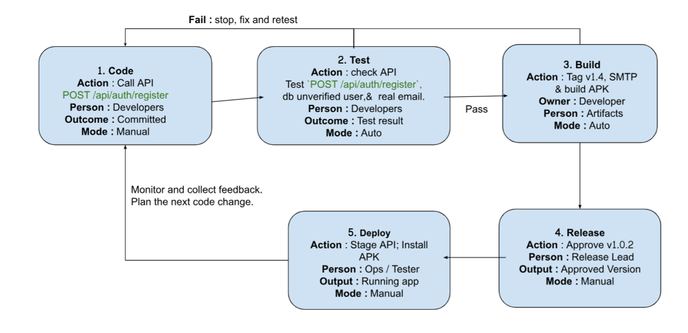

# DevOps Conception Class
- Student: CHRECH SONGHAK

## Lesson 2: My CI/CD pipeline
- Project: IT Support System
- Trigger: push to `feature/register`
- Target: Laravel staging server +  Testing device

### Pipeline design
Code -> Test -> Build -> Release -> Deploy

1. Code: Call API | POST /api/auth/register | Developers | Committed | Manual
2. Test: Check API | Test 'POST /api/auth/register', db unverified user, & real email. | Developers | Test result | Auto
3. Build: Tag v1.4, SMTP & build APK | Developer | Artifacts | Pass | Auto
4. Release: Approve v1.0.2 | Release Lead | Approved Version | Manual
5. Deploy: Stage API; Install APK | Ops / Tester | Running app | Manual

### Controls
On test/build failure: stop, fix and retest | Release approval by: release manager
After deployment, check: app works on the test device | If it fails: rollback or fix and redeploy
Feedback for the next change: monitor app behavior and collect tester feedback

Optional drawing: 
